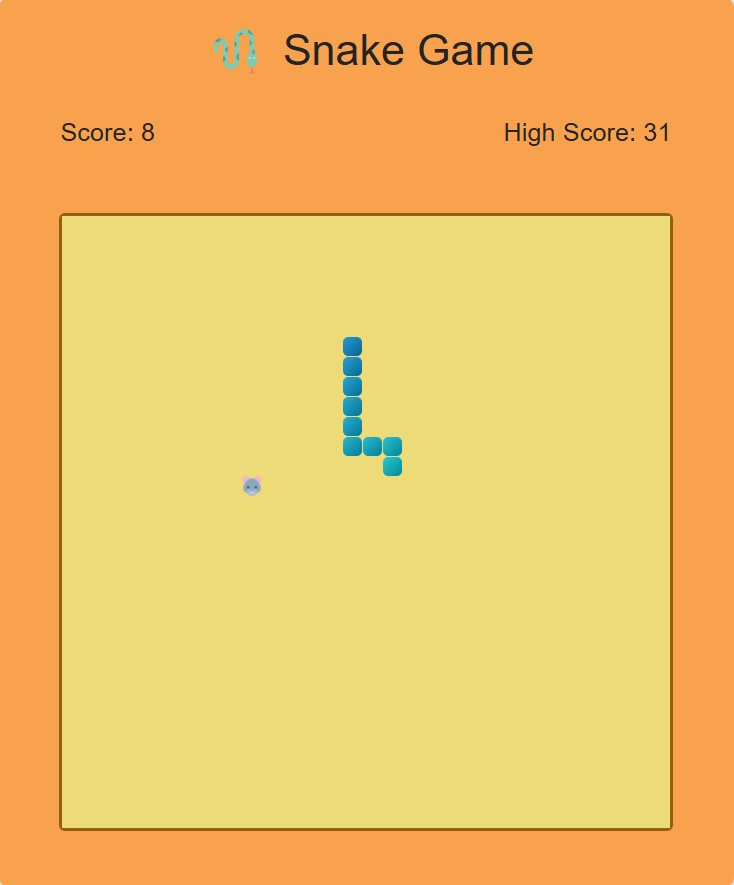

# 🐍 Snake Game

A classic Snake game built with React  and TypeScript. Navigate the snake to eat food while avoiding walls and self-collisions!.
- 🎲 try it: [Snake Game](https://saidaniamine12.github.io/snake-game/)



## 🎮 Features

- **Traditional Snake Gameplay**: Move the snake using arrow keys
- **Score Tracking**: Keep track of your current score
- **Pause/Resume**: Spacebar to pause/resume the game
- **Game Over Detection**: Collision detection with  self
- **Responsive Design**: Works on different screen sizes
- **Visual Feedback**: Clean UI with smooth animations

## 🚀 Technologies Used

- **React** - Frontend framework
- **TypeScript** - Type-safe JavaScript
- **HTML5 Canvas** - Game rendering
- **Material-UI (MUI)** - UI components and styling
- **CSS** - Additional styling

## ⚙️ Installation

1. Clone the repository:
```bash
git clone https://github.com/your-username/snake-game.git
cd snake-game
npm install
npm run dev
